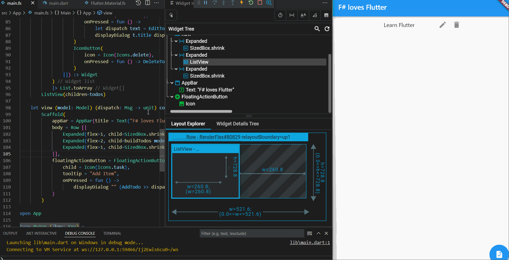
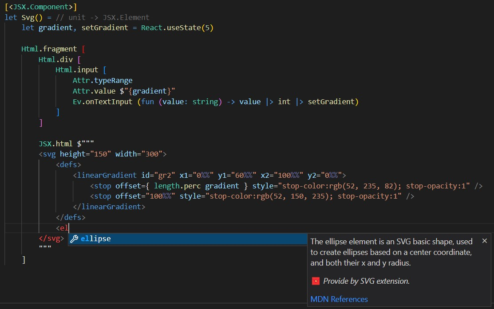

Hey there everybody! It's been a while without Fable news but we're bringing you something today that we hope will get you excited. Today we're announcing the **alpha** release of Snake Island, codename for Fable 4. If you've been following us on Twitter you'll probably know this the most ambitious Fable release to date, extending the compilation targets for F# beyond JS, to include languages like Python, Rust or Dart. The ultimate goal is to convert F# into a super-powerful DSL you can use to design your programs and algorithms and still have the freedom to choose the platform you want to run your code on.

We also believe that, same as it happened with JS, the interaction with other ecosystems and communities is tremendously beneficial for the F# language and developers. Although it makes for a good catch-phrase, Fable wasn't born to make F# "the One to rule them all", instead we'll be most happy if Fable can be a bridge for F# developers to explore other worlds beyond .NET. Some of them have fully crossed the bridge and become Typescript/JS experts. This is great too and we hope it can also happen in the future for Python, Rust or Dart!

Please see below for specific details about each of the new language targets and how you can try each one.

:::warning
Don't update your current Fable JS projects just yet. In principle, everything should work the same as we're aiming for no breaking changes. But there won't be many JS new features (except for JSX compilation, see below) and compiler plugins do need to be updated. So if you're using `ReactComponent` attribute in your project, it won't work yet with Snake Island.
:::

## Python

[Dag Brattli](https://github.com/dbrattli) strongly believes that F# can make for a better Python and has been working on better integration between the languages for several years now. The first attempt was [Expression](https://github.com/cognitedata/Expression), a library that lets you use many of F#/Functional patterns with Python. And since Fable 3 made it easier to extend Fable, Dag has been working on adding Python support, which is currently very close to JS in unit test parity.

Why is it interesting to compile F# to Python? Python is one of the most used programming languages in the world and counts with an according community and ecosystem. Even if F# and .NET have made big improvements in Python stronghold areas like Machine Learning, being able to access the numerous well-documented and battled-tested Python libraries and tools is invaluable. We're particularly interested in interactive programming and are actively exploring this area (you can also check [.NET Interactive Notebooks](https://github.com/dotnet/interactive#readme)).

There are already a number of [libraries and projects](https://github.com/fable-compiler/Fable.Python/blob/main/README.md#libraries-that-uses-or-works-with-fable-python) compatible with Fable Python and you can try it right now with [several examples](https://github.com/fable-compiler/Fable.Python/tree/main/examples#readme) that use F# to write multi-purpose applications like a web server with [Flask](https://flask.palletsprojects.com/en/2.1.x/), a visualization with [Tkinter](https://realpython.com/python-gui-tkinter/) or IoT with [BBC micro:bit](https://microbit.org/).

## Rust

[ncave](https://github.com/ncave) is a long time contributor to F# and Fable community and is responsible for some of their most important achievements, like self-compiling the F# compiler to JS to power the F# and Fable [online](https://try.fsharp.org/) [REPLs](https://fable.io/repl/). Now, together with [Alex Swan](https://github.com/alexswan10k), ncave is working to compile F# to [Rust](https://www.rust-lang.org/) through Fable.

What are the benefits of compiling F# to Rust? Rust is a language with many features inspired from functional programming (expression-based, pattern matching) that focus on correctness and performance. It's a fantastic skill to have in your toolbox. But learning Rust is not always an easy task. Fable can be the bridge between the F# and Rust communities, allowing you to get introduced to Rust ecosystem while reusing your F# knowledge.

Another interesting application is that Rust can be compiled to Web Assembly through [wasm-pack](https://rustwasm.github.io/wasm-pack/). This is already possible with F# and [Blazor](https://dotnet.microsoft.com/en-us/apps/aspnet/web-apps/blazor), but as with native applications going through Rust you avoid having to include the whole .NET runtime in your apps. This makes Rust a better fit when you just want to compile a specific module (that you may have written already for Fable) to WASM for extra performance.

A good example of this is [fable-raytracer](https://github.com/ncave/fable-raytracer) which takes code originally written for Fable and converts it to Rust to get nearly twice better performance than the JS version. You can try this example right now by cloning the repo and following the instructions in the [readme](https://github.com/ncave/fable-raytracer/#readme). And you can track the current progress for Rust compilation [here](https://github.com/fable-compiler/Fable/issues/2703).

## Dart

Cross-platform has been the holy grail of app development for a long time. The .NET team is also be very active in this space with [the recent release of MAUI](https://devblogs.microsoft.com/dotnet/introducing-dotnet-maui-one-codebase-many-platforms/), but there's another project that has gained a lot of traction over the years thanks to its high-quality and great development experience: [Flutter](https://flutter.dev/). And with React-inspired [declarative UIs](https://docs.flutter.dev/development/ui/widgets-intro), Flutter's model is very familiar to most Fable developers.

Dart, the language used for Flutter, is a typed language, with null-safety and very similar to C# so it's a perfect fit for F#. There's still work to do, but thanks to the analysis tools in Dart we're polishing the code generation to get a very clean output. We expect to have even better F#-Dart interoperability than we have with JS!

You can clone [this repo](https://github.com/alfonsogarciacaro/fable-flutterapp) to try a simple Elmish Todo app running in Dart. Note the app translates the original Elmish library code (with small edits) to Dart so it's already quite powerful. Follow the README instructions to start the app: the commands in `build.sh` will start Fable and then you can use a Flutter-compatible IDE (or the [Flutter CLI](https://docs.flutter.dev/get-started/install)) to run and debug Flutter.



When writing your own code for Dart compilation please note the following:

- Dart is **null-safe**, so it won't allow you to assign null to reference types (including strings). For this reason, `Unchecked.default<_>` won't work in many cases, although you can use it to initialize a mutable variable (Fable translates this is an empty `late` var in Dart).
- You may find the `DartNullable` type in Dart bindings, this is similar to `System.Nullable` but can be used also with reference types and is used to express explicit nullability. For your own code, as with standard F#, it's recommended to use `option` to express the possibility of the absence of value. 
- If Dart compiler complains about generics inferred by F#, try adding type annotations to your F# code.
- At the time of writing, print formatting with `(s)printf` is not supported. Use string interpolation and `Fable.Core.Dart.print` instead.

Thanks to [Diego Esmerio](https://github.com/Nhowka) we already have some bindings for the extensive [Flutter Widget Catalog](https://docs.flutter.dev/development/ui/widgets) and we want to improve them with your help. [Any contribution is appreciated!](https://github.com/fable-compiler/Fable/issues/2878)

You can track the current progress for Dart compilation [here](https://github.com/fable-compiler/Fable/issues/2877).

## PHP

Special mention goes to [Jérémie Chassaing](https://github.com/thinkbeforecoding). Because of him, Snake Island will also include PHP among its compilation targets. This will be experimental and likely not supported but we can safely say that Jérémie paved the way to extend Fable to other languages beyond JS. You can learn more about the history of this project, originally named Peeble, [in this presentation](https://skillsmatter.com/skillscasts/14886-peeble-an-f-sharp-php-transpiler).

## JSX

Fable JS wasn't supposed to get any new feature with Snake Island, but at the last minute we've implemented support for yet another language or, more exactly, a language-in-a-language. [JSX](https://reactjs.org/docs/introducing-jsx.html) was introduced by the React team as a way to declare HTML-like UIs directly in JavaScript without the need of a template language. Although Fable has supported React from the start, it never used JSX. Instead it directly output the JS code generated by JSX templates. This made sense because for React JSX was only syntax sugar and this way we could save a compilation step.

However, given the popularity gained by JSX, there are now tools that take advantage of this compilation step to perform code analysis and other operations. Like [SolidJS](https://www.solidjs.com/) which uses JSX to analyze the dependency tree in your code and translate the declarative render functions into surgical imperative updates that don't need a Virtual DOM and are smaller and faster than equivalent React apps (while maintaining the same developer experience overall). We have already implemented a [Feliz](https://zaid-ajaj.github.io/Feliz/)-like API to create Solid apps with good results. For example, the following code:

```fsharp
open Browser
open Feliz.JSX
open Fable.Core

[<JSX.Component>]
let Counter() =
    let count, setCount = Solid.createSignal(0)
    let doubled() = count() * 2
    let quadrupled() = doubled() * 2

    Html.fragment [
        Html.p $"{count()} * 2 = {doubled()}"
        Html.p $"{doubled()} * 2 = {quadrupled()}"
        Html.br []
        Html.button [
            Attr.className "button"
            Ev.onClick(fun _ -> count() + 1 |> setCount)
            Html.children [
                Html.text $"Click me!"
            ]
        ]
    ]
```

Which looks like much of the current existing Feliz apps, will be translated by Fable to:

```js
import { createSignal } from "solid-js";
import { render } from "solid-js/web";

export function Counter() {
    const patternInput = createSignal(0);
    const setCount = patternInput[1];
    const count = patternInput[0];
    const doubled = () => (count() * 2);
    const quadrupled = () => (doubled() * 2);
    return <>
        <p>
            {`${count()} * 2 = ${doubled()}`}
        </p>
        <p>
            {`${doubled()} * 2 = ${quadrupled()}`}
        </p>
        <br></br>
        <button class="button"
            onClick={(_arg1) => {
                setCount(count() + 1);
            }}>
            Click me!
        </button>
    </>;
}
```

Which in turn gets translated by Solid into imperative code that will update only the DOM parts depending on the values that have been updated, instead of running the whole render function. This way you can still write nice declarative code without worrying about memoized components or effects that run when they shouldn't. This is a similar idea to [Svelte](https://svelte.dev/), or what [FSharp.Adaptive](https://fsprojects.github.io/FSharp.Data.Adaptive/) and [Sutil](https://sutil.dev/) projects had already implemented for F#/Fable.

Soon JSX will be available to Fable React apps too! Though as commented above, it won't make a big difference (and in fact it can be more limiting as JSX needs to be interpreted statically) but we are also introducing JSX templates which can be particularly helpful when bringing external HTML code to your app. And with the [F# template highlighting VS Code extension](https://marketplace.visualstudio.com/items?itemName=alfonsogarciacaro.vscode-template-fsharp-highlight) you can achieve a very similar experience to [Fable.Lit](https://fable.io/Fable.Lit/).



This basically means you'll be able to write JSX code directly into your F# app! And you can try it out already with Solid and Snake Island by cloning [this repo](https://github.com/alfonsogarciacaro/Feliz.Solid).

<br />
<hr />
<br />

Hopefully you're now as excited as we are! You can give Snake Island a go right now by following the instructions for each language above or installing it locally specifying the `snake-island` version range:

```
dotnet tool install fable --local --version 4.0.0-snake-island-*
```

Now you can test the different targets by calling the tool as with Fable 3 and passing the `--lang` option. For example if you want to compile a script to Python, run:

```
dotnet fable MyScript.fsx --lang python
```

:::info
Just remember that supporting the whole .NET Base Class Library is not one of Fable's goal, so calls to `System.IO` and friends won't work. Please check the current [BCL Compatibility Guide](https://fable.io/docs/dotnet/compatibility.html) for JS as reference, though the new language targets still lag behind.
:::

As mentioned above this a very ambitious project, and Fable is still an Open Source project maintained by contributors in their free time. We don't have strict roadmaps or deadlines, Snake Island has emerged because each of the contributors had a personal interest in using Fable to bring F# to an ecosystem they love (if you want Fable to target a new language, contribute!). We're still in the alpha release cycle and there are many challenges left until having a stable version. We can only overcome these challenges with the help of the community, you don't need to dive into the compiler code to fix bugs and add features, but it's very important for contributors to know their work is helping others, get feedback and receive words of encouragement (in Github or Twitter). Community contributions have been crucial for previous Fable releases, let's also bring this one to life together!

Best and Slava Ukraini!