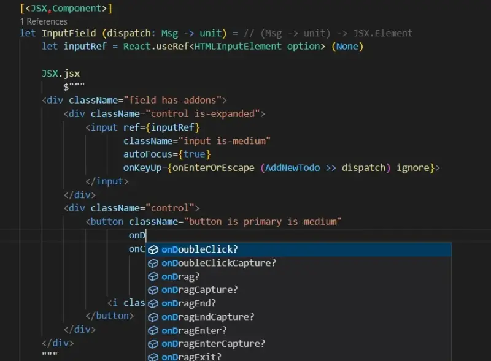

In a [previous post](2022-06-06-Snake_Island_alpha.html) we announced the incoming JSX support in Fable 4. This was originally intended for integration with [SolidJS](https://www.solidjs.com/), which can transform JSX during compilation into reactive and perfomant JS code. Most of the existing Fable web apps though, use [React](https://reactjs.org/) instead, the framework that originally introduced the [JSX dialect](https://reactjs.org/docs/introducing-jsx.html) as a way to better declare UIs in JavaScript. However, when we first wrote the Fable React adapters we didn't feel the need to integrate JSX in F# for several reasons:

- JSX was just sugar syntax and actual React apps were just JS code at the end
- Fable cannot modify the F# language, and extending the F# syntax is a big undertake
- F# is already expressive enough to create UI APIs, like the original Fable.React or [Feliz](https://zaid-ajaj.github.io/Feliz/)

Nonetheless, since F# added support for string interpolation, we've been exploring ways to embed languages and we had great success integrating F# and HTML with [Fable.Lit](https://fable.io/Fable.Lit/), including [editor support](https://marketplace.visualstudio.com/items?itemName=alfonsogarciacaro.vscode-template-fsharp-highlight). Since JSX is very similar to HTML, why not give it a try too?

Today we're pleased to announce these experiments have been successful and with the latest release of Fable 4 (4.0.0-theta-011 at the time of writing) it's possible to use JSX to write your React components directly in F#. The [F# Template Highlighting](https://marketplace.visualstudio.com/items?itemName=alfonsogarciacaro.vscode-template-fsharp-highlight) VS Code extension has also been udpated to provide syntax highlighting and autocompletion. Moreover, you don't need to change your existing code to integrate JSX into your app: it is 100% compatible with the current React types and libraries.



> The interpolation "holes" must follow the JSX syntax rules, that is, they can only appear in attribute value or child positions.

In order to use JSX make sure your app fulfills the following:

- Use fable tool 4.0.0-theta-011 or higher
- Use Fable.Core package 4.0.0-theta-005 or higher
- JS bundler can compile JSX (e.g. with Vite, use `@vitejs/plugin-react`)
- Use .jsx extension to activate JSX compilation (pass `-e .jsx` CLI argument to Fable)

> If you use `Feliz.ReactComponent` plugin, remember to add Feliz.CompilerPlugins package 2.0.0-prerelease-003 or higher to when upgrading to Fable 4.

Although the new `JSX.Element` type from Fable.Core and `ReactElement` for Fable.React are different types, in React apps they are just the same. So you may want to add some helpers to convert between `JSX.Element` and `ReactElement`, or to integrate some code in the JSX holes. For example:

```fsharp
open Fable.Core
open Feliz

let inline toJsx (el: ReactElement) : JSX.Element = unbox el
let inline toReact (el: JSX.Element) : ReactElement = unbox el

/// Enables use of Feliz styles within a JSX hole
let inline toStyle (styles: IStyleAttribute list) : obj = JsInterop.createObj (unbox styles)

let toClass (classes: (string * bool) list) : string =
    classes
    |> List.choose (fun (c, b) ->
        match c.Trim(), b with
        | "", _
        | _, false -> None
        | c, true -> Some c)        
    |> String.concat " "
```

The basics helpers from Fable.Core that you use for JSX are:

- `JSX.Component` attribute: decorates function that will be called as JSX components. Works similarly to [Feliz ReactComponent](https://zaid-ajaj.github.io/Feliz/#/Feliz/React/StatelessComponents).
- `JSX.Element` type: returned by `JSX.jsx` and other helpers. In React apps, it's the same as `ReactElement`.
- `JSX.jsx` function: compiles a literal string template as JSX.

> Check the `Fable.Core.JSX` module for additional helpers

## 3rd Party React Components

One of the most interesting applications of JSX is to integrate 3rd party React components without having to write any binding at all. Feliz already provided [a way to easily interop with JSX components](https://zaid-ajaj.github.io/Feliz/#/Feliz/UsingJsx) but it involved a separate .jsx file. Now you can integrate 3rd party JSX components directly into your F# code! Fable even adds a "hack" to allow you have imports within the JSX expression. Fable will automatically extract the import and move it to the top of the file (just remember to escape the braces so F# doesn't interpret it as an interpolation hole).

For example, [Shoelace](https://shoelace.style/) provides many useful components. Say you want to use the [QR Code generator](https://shoelace.style/components/qr-code), you can check their sample and use it as-is in your code.

```fsharp
[<ReactComponent>]
let QrCode() =
    let value, setValue = Hooks.useState("https://fable.io/") |> asTuple

    React.fragment [
        Html.input [
            prop.className "input mb-5"
            prop.type' "text"
            prop.autoFocus true
            prop.value (value)
            prop.onTextChange setValue
        ]
        Html.div [
            toReact <| JSX.jsx $"""
            import {{ SlQrCode }} from "@shoelace-style/shoelace/dist/react"

            <SlQrCode value={value} radius="0.5"></SlQrCode>
            """
        ]
    ]
```

<hr />

You can check [this example](https://github.com/alfonsogarciacaro/fable-react-sample/tree/6cdfa0acda587d4b051c88234d790b4dfcdd9276) to quickly test JSX integration. Just clone the repository and run `npm install && npm start` to launch a development server, and try editing the code in TodoMVC.fs to see the web contents updated on the fly. Please give it a try and let us know what you think!

In a future post, we'll discuss JSX with Fable [SolidJS](https://www.solidjs.com/) apps. Thanks for reading so far and happy coding!