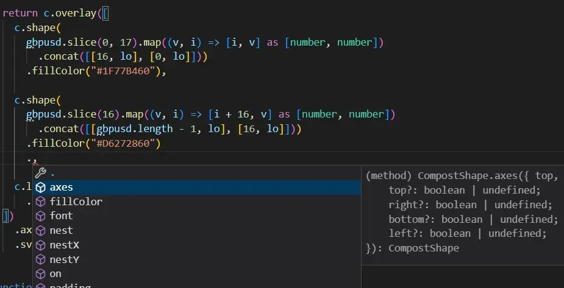

If you are a Fable user you may have noticed that we released, quite quietly, Fable 4 a few weeks ago. For existing F# to JS projects, Fable 4 brings exciting new features like dotnet 7 and [JSX](../2022/2022-10-12-react-jsx.html) support, but most importantly Fable 4 takes F# beyond JS with the addition of new targets like [Python, Rust or Dart](../2022/2022-06-06-Snake_Island_alpha.html). Though the new major release didn't mean all targets are ready for production, as [we discussed in a previous post](../2022/2022-09-28-fable-4-theta.html#language-status), we have decided to keep a single tool but let each language evolve at its own pace.

> If you haven't upgraded yet, we recommend you do it soon: there are no breaking changes and you [only need to update a few packages](../2022/2022-09-28-fable-4-theta.html#packages-updated-for-fable-4).

With Fable 4.1 we are happy to announce one of those targets is ready for prime-time! Thanks to the effort of [ncave](https://github.com/ncave) who has been leading the effort to add type annotations to JS output (in spite of my initial reluctance) for a long time, TypeScript compilation started to become a real possibility. We have been working together in the last month and TypeScript generated code is almost on par now with JS so we have decided to bump the status from beta to stable 🚀

Wait a moment, compiling to TypeScript? Does this mean I should compile all my JS apps to TypeScript from now on for extra type-safety? No, we don't recommend that. In fact, you probably shouldn't. Many Fable libraries already emit JS code that TypeScript may not accept happily and we cannot control that. TypeScript compilation is intended for integrating F# into existing TypeScript and to write libraries that can be published to npm and consumed with a type-safe API. This is in line with the focus we are giving to the new language targets: instead of trying to do everything in F#, we will concentrate our efforts on having a great experience with [Domain Programming](https://fsharpforfunandprofit.com/ddd/) in all platforms. This means spending less time writing bindings for native libraries and instead working on generating nice code that can be easily consumed.

> All-F# frontend apps will still be supported for JS compilation, and it's also possible for contributors to extend Fable for Python/Rust/Dart to support all-F# projects (writing bindings or providing templates and tutorials, etc).

As always, the best way to understand what TypeScript compilation can do for you is to get your hands on a project, and there's no better one than [compostjs](https://compostjs.github.io/compost/), another great library from [Tomas Petricek](https://tomasp.net/) to create charts through composition. Compostjs is written in F#, compiled to JS and published to npm. It already offers a nice and [documented API](https://compostjs.github.io/compost/api.html). But the IDE experience is not that great, because the type information was missing in the compilation... until now. [This fork](https://github.com/alfonsogarciacaro/compost/) adapts compostjs to be compiled to TypeScript with Fable 4.1, and it also enables fluent APIs that are self-discoverable and can be type-checked also for TS/JS consumers!



If you want to try it out, clone [the fork](https://github.com/alfonsogarciacaro/compost/) and run the following commands:

```bash
dotnet tool restore
npm install
npm start
```

Then you can open `src\project\App.tsx`, edit the code and see the changes in the browser and how the IDE will guide you and warn of potential mistakes.

## How to expose a nice TypeScript API

The mechanisms to expose a nice API are the same as [when consuming JS code from F#](https://fable.io/docs/communicate/js-from-fable.html#type-safety-with-imports-and-interfaces). First, use **interfaces** to define the contracts between F# and native code. This is because Fable by default won't mangle interfaces. You can use interfaces when [exporting](https://github.com/alfonsogarciacaro/compost/blob/e783ed687bc19887f02aa0b071585a1a152c8956/src/compost/compost.fs#L80-L110), [creating a fluent API](https://github.com/alfonsogarciacaro/compost/blob/e783ed687bc19887f02aa0b071585a1a152c8956/src/compost/compost.fs#L203-L226) or declaring [complex arguments](https://github.com/alfonsogarciacaro/compost/blob/e783ed687bc19887f02aa0b071585a1a152c8956/src/compost/compost.fs#L14-L22) (this is particularly useful for dependencies that need to be injected from native code):

```fsharp
open Fable.Core
open Browser.Types

type Coord = U2<float, obj * float>
type Point = Coord * Coord

type Handlers =
  abstract mousedown: (Coord -> Coord -> MouseEvent -> unit) option
  abstract mouseup: (Coord -> Coord -> MouseEvent -> unit) option
  abstract mousemove: (Coord -> Coord -> MouseEvent -> unit) option

type CompostShape =
  abstract on : handlers: Handlers -> CompostShape

type Compost =
  ...
  interface CompostShape with
    member s.on(h: Handlers) =
      Shape.Interactive([
        match h.mousedown with
        | None -> ()
        | Some f -> yield MouseDown(fun me (x, y) -> f (formatValue x) (formatValue y) me)
        
        match h.mouseup with
        | None -> ()
        | Some f -> yield MouseUp(fun me (x, y) -> f (formatValue x) (formatValue y) me)
        
        match h.mousemove with
        | None -> ()
        | Some f -> yield MouseMove(fun me (x, y) -> f (formatValue x) (formatValue y) me)
      ], s)
```

Because all `Handlers` fields are optional, the method can be called from JS/TS passing only a number of them:

```ts
c.line(data)
    .strokeColor("#202020")
    .on({
        mousedown: (x, y) => console.log("CLICK!", x, y)
    })
```

> A similar effect can be reached with [anonymous records](https://learn.microsoft.com/en-us/dotnet/fsharp/language-reference/anonymous-records).

### Exporting members

A disadvantage of exporting an object expression is it won't play well with [tree shaking](https://developer.mozilla.org/en-US/docs/Glossary/Tree_shaking), so you can use a plain module instead. Just make sure there is only **one single root module** in the file to prevent automatic mangling:

```fsharp
// It doesn't matter if the module is nested in a namespace
module MyNamespace.MyModule

let add x y = x + y
let multiply x y = x * y
```

This method is not perfect either because F# module methods cannot have optional arguments. If you need them you can use an erased static class with `Mangle(false)` attribute.

```fsharp
namespace MyNamespace

open Fable.Core

[<Erase; Mangle(false)>]
type MyClass =
    static member add (x: int, ?y: int) = x + defaultArg y 0
    static member multiply (x: int, ?y: int) = x * defaultArg y 1
```

The produced JS/TS code is the same as with the module above (except for the optional arguments). As with interfaces, in this case overloads cannot be used and you also need to be careful to avoid name conflicts.

### Erased unions

Precisely, because overloads are not supported in JS, TypeScript often uses what we call _erased_ unions (to tell them apart from _actual_ F# unions) to allow different types of arguments. Fable can [represent these in F#](https://fable.io/docs/communicate/js-from-fable.html#erase-attribute) with unions decorated with `Erase` attribute. You can expose them in your APIs and even use pattern matching, but be aware this is translated to standard JS runtime testing (`typeof`, `instanceof`, `Array.isArray`...) so only use erased unions with [distinct JS primitives](https://fable.io/docs/dotnet/compatibility.html#net-base-class-library) (e.g. no `U2<int, float>`).

```fsharp
open Fable.Core.JsInterop

type Coord = U2<float, obj * float>

let private formatValue (v: Value): Coord = 
  match v with 
  | COV(CO v)    -> U2.Case1(v)    // or ^!v
  | CAR(CA c, r) -> U2.Case2(c, r) // or ^!(c, r)

let private parseValue (v: Coord): Value =
  match v with
  | U2.Case1 v -> COV(CO(v))
  | U2.Case2 (a1, a2) -> CAR(CA(string a1), a2)
```

Even if the declaration is erased the correct type is shown for the return and argument types in TypeScript:

```ts
function formatValue(v: Value_$union): float64 | [any, float64] {
    if (v.tag === /* CAR */ 0) {
        const r: float64 = v.fields[1];
        const c: string = v.fields[0].fields[0];
        return [c, r] as [any, float64];
    }
    else {
        const v_1: float64 = v.fields[0].fields[0];
        return v_1;
    }
}

function parseValue(v: float64 | [any, float64]): Value_$union {
    if (isArrayLike(v)) {
        const a2: float64 = v[1];
        const a1: any = v[0];
        return Value_CAR(new categorical(toString(a1)), a2);
    }
    else {
        const v_1: float64 = v;
        return Value_COV(new continuous(v_1));
    }
}
```

### Named arguments

While JS/TS accept optional arguments, they cannot be omitted unless they are at the end position. Because of this, it is common to pass a dictionary object instead (as with Python). In Fable you could use the `NamedParams` to represent this situation in bindings, and now you can also use it when declaring your own APIs:

```fsharp
type CompostShape =
  [<NamedParams>]
  abstract axes: ?top: bool * ?right: bool * ?bottom: bool * ?left: bool -> CompostShape

  // If there are positional arguments too, indicate where the named arguments start
  [<NamedParams(fromIndex=1)>]
  abstract mixMethod: positionalArg: float * ?namedArg1: string * ?namedArg2: int -> unit
```

This can be consumed from TypeScript like:

```ts
shape.axes({ right: true, bottom: true, left: true }) // ok
shape.axes({ top: "false" }) // TS error, wrong type
shape.axes({ vertical: true }) // TS error, wrong name
```

### F# Unions in TypeScript

We'll finish this post talking about another interesting feature of the TypeScript compilation. Besides _erased_ unions you can also expose _actual_ F# unions and even do pattern matching in TypeScript! This is because Fable uses TypeScript literal types to annotate the unions with their tag. Given an example like this:

```fsharp
type MyUnion =
    | Foo of string * string
    | Bar of float
    | Baz

let test (x: MyUnion) =
    match x with
    | Foo (_, b) -> b.ToUpperInvariant()
    | Bar a -> a + 5.3 |> sprintf "%f"
    | Baz -> "Baz"
```

If you inspect the generated code, you will see how Fable generates extra types in TypeScript for each union:

```ts
export type MyUnion_$union = MyUnion<0> | MyUnion<1> | MyUnion<2>;

export type MyUnion_$cases = { 0: ["Foo", [string, string]], 1: ["Bar", [float64]], 2: ["Baz", []] };

export class MyUnion<Tag extends keyof MyUnion_$cases> extends Union<Tag, MyUnion_$cases[Tag][0]> {
    constructor(readonly tag: Tag, readonly fields: MyUnion_$cases[Tag][1]) {
        super();
    }
    cases() {
        return ["Foo", "Bar", "Baz"];
    }
}

export function test(x: MyUnion_$union): string {
    // Here the types of `fields` are still unknown
    switch (x.tag) {
        case /* Foo */ 0: {
            // Here TypeScript knows that `fields` is a tuple of two strings
            const b: string = x.fields[1];
            return b.toUpperCase();
        }
        case /* Bar */ 1: {
            // If you hover over `x` within this branch, you'll see
            // `MyUnion_$union` type has collapsed to `MyUnion<1>`
            const a: float64 = x.fields[0];
            return toText(printf("%f"))(a + 5.3);
        }
        // If you comment out any of the cases or use a number outside
        // the tag range, TypeScript will complain
        case /* Baz */ 2:
            return "Baz";
    }
}
```

> The extra types are just aliases that only exists in TypeScript, so they won't have any effect in the runtime.

A switch against a number is very fast. TypeScript consumers, however, may find it more convenient to match against the name. They can do it with the same level of type safety:

```ts
switch (x.name) {
    case "Foo": {
        const b: string = x.fields[1];
        return b.toUpperCase();
    }
    case "Bar": {
        const a: float64 = x.fields[0];
        return toText(printf("%f"))(a + 5.3);
    }
    case "Baz":
        return "Baz";
}
```

Same as with tags, TypeScript will check you are using the correct case names, whether the switch is comprehensive and the correct `fields` types within each branch.

This is not the only convenience that Fable TypeScript compilation offers. When you need to instantiate an F# union from TS it's cumbersome to use the tag as a generic argument, so convenience helpers are offered as constructors for each case:

```ts
test(MyUnion_Foo("a", "b"))
test(MyUnion_Bar(5))
test(MyUnion_Baz())
```

## Compilation options

In order to compile to TypeScript, you only need to pass the `--lang ts` option to Fable tool, but let's have a look at [the extra options in the compostjs example](https://github.com/alfonsogarciacaro/compost/blob/e783ed687bc19887f02aa0b071585a1a152c8956/package.json#L7-L11):

```
dotnet fable src/compost -o src/compost-ts --lang ts --fableLib fable-library --noReflection
```

- `--fableLib fable-library`: So far, Fable has been embedding the library files in each project, but from now on we are also [distributing it through npm](https://www.npmjs.com/package/fable-library). By using this compiler option you can tell Fable to use the npm package instead of the embedded files. This is is particularly useful if a consumer installs two or more libraries compiled with Fable, to avoid duplication of the library files.

> Since Fable 4.1.2, when the tool starts, after printing the compiler version it will also tell you the minimum fable-library version compatible with the generated code.

- `--noReflection`: By default Fable emits helpers for each declared type containing reflection information. These are used, for example, when generating [auto coders with Thoth.Json](https://thoth-org.github.io/Thoth.Json/documentation/auto/introduction.html). You don't need to care much about them because if not used they will be removed by tree shaking. But if you are not using reflection you can select this option to reduce the amount of generated code.

If publishing the library to npm, you will also need an extra step to compile the TypeScript code to JavaScript and generate the declaration files. You can use the TypeScript compiler for that like follows:

```
npm run fable && tsc --outDir ./dist --declaration --noEmit false
```

In most situations you will also need a [tsconfig.json file](https://www.typescriptlang.org/docs/handbook/tsconfig-json.html). You can use [the one in the compostjs example](https://github.com/alfonsogarciacaro/compost/blob/e783ed687bc19887f02aa0b071585a1a152c8956/tsconfig.json) as reference.

<br />

---

<br />

That was it! There are still a few things missing in TypeScript compilation, but we believe it's already in a state that will let you integrate F# in TypeScript projects and/or write npm libraries in F# with confidence. We hope you find it useful and we are looking forward for all the great things you are going to build with F# and Fable. Make sure to let us know!
